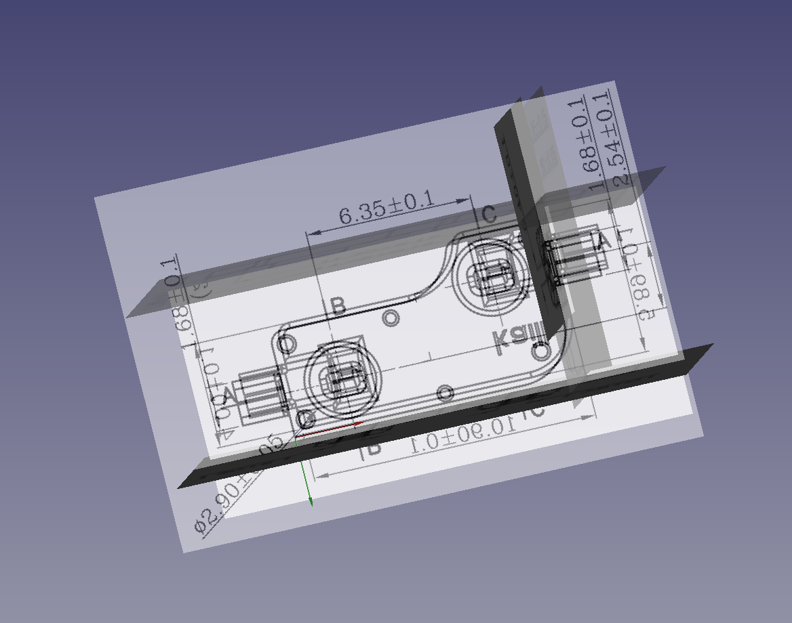
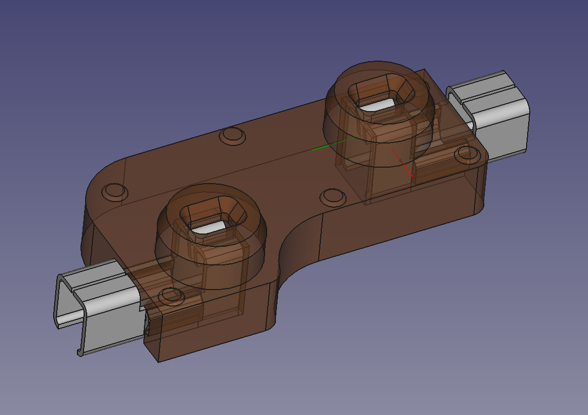
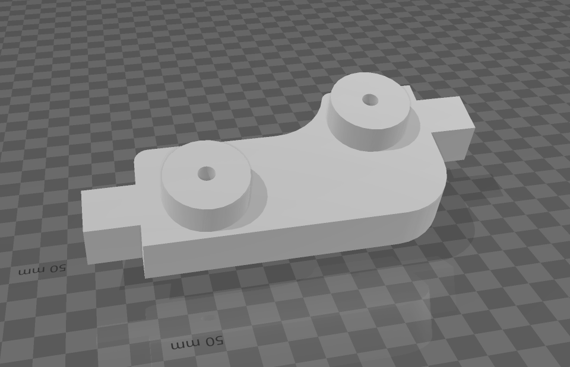

# kailhsocket-freecad
A 1:1 3d model of the Kailh Hotswap socket made from references images and specifications.

# Kailh socket freecad

I created this 3d model from the Kailh specifications (which are not so easy to find). My intention was to get an accurate model of the socket so that I could model mechanical keyboard plates for 3d printing. Without accurate dimensions of the hotswap, that task was very difficult. I only found one other 3d model of the hotswap socket (by Anthony Marin if I recall correctly). And although that model was very good, when comparing the complete specifications I found inaccuracies that were enough to throw off my modeling.

Notes:
* This was created started with Freecad version 0.19
* Reference images are included (since they are difficult to find). Copyright to Kailh for any specifications or images found.
* I did not model some of the minor details such as the lettering as it does not generally impact those of us looking to build components around the socket.

# Kailh socket Boolean

This is a boolean body of the socket. I find the boolean body sufficient in most of my keyboard layout / plate design projects and as such this body is more useful than importing the entire model. It can also be possibly used to add tolerances and such when designing for 3d printing projects based around the socket.

