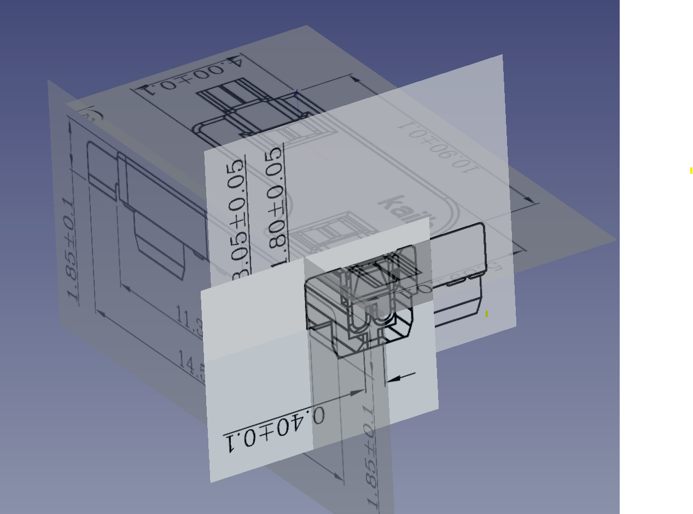
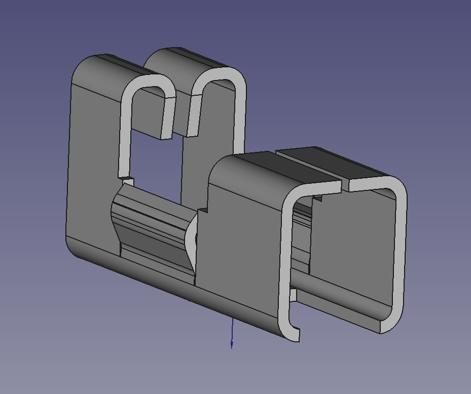

# kailhsocket-freecad
A 1:1 3d model of the Kailh Hotswap socket made from references images and specifications.

# Kailh socket freecad

I created this 3d model from the Kailh specifications. My intention was to get an accurate model of the socket so that I could model mechanical keyboard plates for 3d printing. I only found one other 3d model of the hotswap socket. And although that model was very good, when comparing the complete specifications I found inaccuracies that were enough to throw its use in modeling. I needed something more accurate.

Notes:
* This was started with Freecad version 0.19 (I have not checked newer versions).
* Reference images are included (since they are difficult to find). There is also a master database of dimensions and sketches should anyone find any discrepancy.
* I did not model some of the minor details such as the lettering and edge chamfers as it does not generally impact those of us looking to build components around the socket.
* I based the metal wing dimensions partially from the specifications and from the work of Anthony Marin's fusion 360 model.

# Kailh socket Boolean

This is a boolean body of the socket. I find the boolean body sufficient in most of my keyboard layout / plate design projects and as such this body is more useful than importing the entire model. It can also be possibly used to add tolerances and such when designing for 3d printing projects based around the socket.

